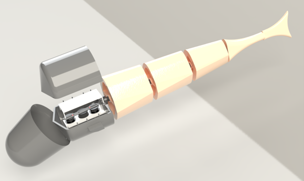
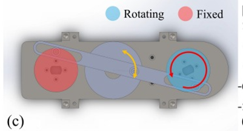
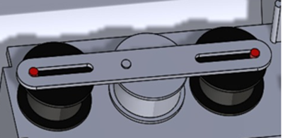
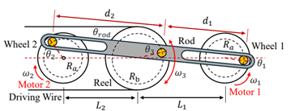
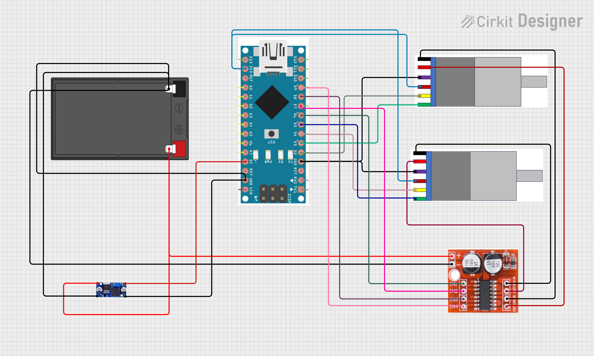

# 2-DoF Fish Robot - Kinematics Project


Robotic fish have attracted significant attention for their biomimetic design and applications in environmental monitoring, biological surveys, and underwater exploration. Unlike propeller-driven systems, which generate noise and disturb marine ecosystems, robotic fish provide efficient and less intrusive locomotion.

This project builds on the work of Wang et al. (2026) by focusing on the kinematic modeling of a wire-driven fish equipped with a 2-DoF crank-slider mechanism. The design decouples propulsion from steering, enabling both high swimming speed and agile maneuverability. While the original study employed servo-based continuous rotation control, our project simplifies the system using budget-friendly components and replaces the motor control with an encoder-based PID algorithm. This ensures smooth, accurate motion while retaining the core crank-slider actuation and robotic system architecture.

---

## Table of Contents

- [Design Analysis](#design-analysis)
  1. [Original Design Concept from the Research Paper](#1-original-design-concept-from-the-research-paper)
  2. [Description of the SolidWorks Design](#2-description-of-the-solidworks-design)
  3. [Mechanism Type and Degree of Freedom](#3-mechanism-type-and-degree-of-freedom)
  4. [Kinematic Analysis](#4-kinematic-analysis)
  5. [Material Selection](#5-material-selection)
  6. [Limitations of the Current Design](#6-limitations-of-the-current-design)
  7. [Conclusion](#7-conclusion-design-analysis)
- [Motion Control](#motion-control)
  - [Methodology and Implementation](#methodology-and-implementation)
    1. [System Overview](#1-system-overview)
    2. [Forward Kinematics Derivation](#2-forward-kinematics-derivation)
    3. [Tail Kinematics](#3-tail-kinematics)
    4. [Implementation](#4-implementation)
    5. [Velocity Estimation and Propulsion](#5-velocity-estimation-and-propulsion)
    6. [Results and Interpretation](#6-results-and-interpretation)
    7. [Discussion](#7-discussion)
  - [Symmetric Motion Case (Forward Motion)](#symmetric-motion-case-forward-motion)
  - [Non-symmetric Motion Case (Turning Motion)](#non-symmetric-motion-case-turning-motion)
- [Hardware and Programming Implementation](#hardware-and-programming-implementation)
- [Conclusion](#conclusion)
- [References and Links](#references-and-links)
---

## Design Analysis

In this section, we analyze the Biomimetic Fish Robot Based on a Modified 2-DoF Crank-Slider / Slotted Crank-Rocker Mechanism.

*Figure 1: Fish Robot Rendered Image*


### 1. Original Design Concept from the Research Paper

The original robotic fish consists of a rigid head shell, segmented rear body, elastic spine, driving wire, pectoral fins, and passive caudal fin. The rigid head contains the actuation mechanism and electronics, while the rear body bends to generate fish-like swimming motion.

The actuation mechanism in the paper contains two independently controlled driving wheels connected to a slotted rod and reel. The reel drives a wire connected to the tail. The main advantage of the mechanism is that it can operate in symmetric and asymmetric modes. In symmetric mode, both motors rotate together to produce forward propulsion. In asymmetric mode, one motor can create a mean tail offset while the other provides continuous oscillation, allowing turning motion.

The original prototype used compact DYNAMIXEL servo motors, a PLA body and head, SUS304 stainless steel linkage components, a silicone waterproof skin, and an elastic urethane spine. The paper reports that the prototype was 502 mm long, 83 mm wide, 128 mm high, and had a mass of 2050 g.


*Figure 2: Reference 2-DoF Actuation Concept and The Adapted SolidWorks Linkage Layout*

### 2. Description of the SolidWorks Design

The SolidWorks model follows the same general fish structure as the paper but includes important changes to fit the available components. The design contains a deeper front tub, internal gears, DC motors, a slotted rocker linkage, segmented cylindrical body parts, and a tail fin. The main design focus was packaging the actuation mechanism inside the head while maintaining the external appearance of a fish.

The head tub is the main mechanical housing. It supports the motors, gears, shafts, rocker link, and cover. Since the DC motors used in this project are much taller than the servo motors in the original paper, the tub had to be significantly deeper. This modification allowed the motors to fit vertically while leaving enough clearance for the gears and moving linkage.

The final SolidWorks model has an overall length of 1051 mm, a maximum width of 190 mm, and a maximum height of 159 mm. These dimensions represent the complete assembled fish robot, including the rigid head, internal motor tub, segmented body, and caudal fin. Compared with the original paper, the overall dimensions are larger mainly because our design uses taller DC motors with encoders, which require a deeper head section to fit the motors, gears, and linkage mechanism.

The rear body was modeled as multiple streamlined segments to represent the flexible body of the fish. The caudal fin was modeled at the rear to represent the tail surface responsible for producing thrust when oscillated.

### 3. Mechanism Type and Degree of Freedom

The mechanism in the SolidWorks design is best described as a double-input slotted crank-rocker mechanism inspired by the paper's 2-DoF crank-slider system. The rotating gears or disks act as cranks. The pins on these gears slide inside elongated slots in the long central link. This long link does not rotate continuously through 360 degrees; instead, it oscillates through a limited angle. Therefore, it behaves like a rocker.

The rocker type used in this design is a slotted rocker. It is "slotted" because the crank pins move inside long slots, and it is a "rocker" because its output is limited to angular oscillation rather than full rotation.

The output of the rocker is transmitted to the elastic tail through a driving wire. One end of the wire is fixed to the reel, which is attached to the central rocker link, and the other end is fixed to the trailing section of the elastic spine. As the rocker oscillates, it winds and unwinds the wire alternately, pulling the tail from side to side and generating the oscillatory body motion required for propulsion. The wire offset distance *d* from the spine centerline converts the reel's angular displacement directly into the tail attack angle θₐ.

In its complete actuated form, the system has two actuated degrees of freedom because it uses two independently driven motors. The motors are independently controlled — one input can affect oscillation frequency and the other can affect the mean tail angle. However, if both motors are synchronized or if one motor is fixed while the other rotates, the mechanism behaves as an effective 1-DOF mechanism during that operating condition.

The degrees of freedom of the mechanism are verified using the Kutzbach criterion:

$$M = 3(n - 1) - 2j_1 - j_2$$

where *n* is the number of links, *j₁* is the number of full joints (one degree of freedom each), and *j₂* is the number of half joints (two degrees of freedom each). The mechanism consists of 5 links: the ground frame, the two driving cranks (gear disks), middle gear, and the central slotted rocker. It has 4 full joints: the two revolute joints at the motor shafts and the two pin-in-slot joints between the crank pins and the rocker slots.

Substituting:

$$M = 3(5 - 1) - 2(4) - 1(2) = 12 - 8 - 2 = 2$$

When one motor is set to a bias angle:

$$M = 3(4 - 1) - 2(3) - 1(2) = 1$$

Hence the system has **2 DoF in symmetric mode** and **1 DoF in asymmetric mode**.

### 4. Kinematic Analysis

The purpose of the internal mechanism is to convert motor rotation into oscillating tail motion. Each motor rotates a gear or disk with an offset pin. As the disk rotates, the pin follows a circular path. Since the pin is located inside a slot in the rocker, the circular motion forces the rocker to oscillate.

The operating sequence is as follows:

1. DC motors rotate the gears.
2. The gear pins move inside the rocker slots.
3. The rocker oscillates from side to side.
4. This oscillation is transmitted to the tail.

The resulting tail motion imitates the left-right tail beat of a swimming fish.

When both motors rotate together, the mechanism produces a more symmetric oscillation suitable for forward swimming. When one motor position is shifted or fixed while the other rotates, the output becomes biased to one side. This creates a mean tail angle and can be used for turning.

### 5. Material Selection

For a prototype, the head tub and body sections are manufactured using PLA because it is easy to 3D print and suitable for rapid prototyping.

For the linkage and rocker, a stronger material such as aluminum or stainless steel is preferred because these parts experience sliding contact and repeated oscillating loads. The original paper used SUS304 stainless steel for the actuation linkage, which provides good strength and corrosion resistance. Our project uses a 3D printed link due to a tight schedule.

The spine should be made from a flexible material such as rubber, silicone, TPU, or another compliant polymer.

**Table 1: Selected Part Material**

| Part | Suggested Material | Reason |
|---|---|---|
| Head tub / rigid shell | PLA | Easy to 3D print, rigid, suitable for prototypes |
| Body segments | PLA | Lightweight and simple to manufacture |
| Slotted rocker / linkage | Aluminum or SUS304 stainless steel | Higher stiffness and better wear resistance |
| Gear shafts | Steel or stainless steel | Good strength and alignment stability |
| Spine | TPU, rubber, or silicone | Flexible and suitable for oscillating tail motion |

### 6. Limitations of the Current Design

The main limitation is the large head depth caused by using tall DC motors, making the design less compact than the original and potentially reducing swimming efficiency due to increased drag.

Although the design uses DC motors equipped with encoders (which improves motion feedback), the servo motors used in the original are more accurate.

The slotted rocker mechanism may also experience friction and wear at the sliding contacts. Bearings, bushings, or low-friction inserts could improve the motion.

### 7. Conclusion (Design Analysis)

The SolidWorks model successfully recreates the main mechanical concept of the robotic fish presented in the reference paper. The design uses a double-input slotted crank-rocker mechanism inspired by the 2-DoF crank-slider actuation system. The mechanism converts rotary input from two motors into an oscillating rocker motion that can be transferred to the tail.

The largest design difference is the actuator selection. The original research prototype used compact servo motors, while this project used taller DC motors, requiring a much deeper head tub. The mechanism has 2 actuated degrees of freedom when both motors are independently controlled, but can behave as an effective 1-DOF mechanism when synchronized. Future improvements are needed in compactness, waterproofing, friction reduction, and motion validation.

---

## Motion Control

### Methodology and Implementation

#### 1. System Overview

The fish robot is designed based on a biomimetic actuation mechanism that converts rotational motor inputs into oscillatory tail motion. The system consists of two motor-driven cranks connected to a reel through linkages, forming a crank–slider mechanism. This configuration enables controlled deformation of a flexible tail, which generates propulsion through periodic motion (Lee et al., 2007).

#### 2. Forward Kinematics Derivation

The objective of forward kinematics is to compute the reel angle θ₃ from the known motor angles θ₁ and θ₂.

**Coordinate Representation**

The positions of the mechanism components are defined as:

$$x_1 = R_a \cos\theta_1 + L_1 + L_2, \quad y_1 = R_a \sin\theta_1 \tag{1}$$

$$x_2 = R_a \cos\theta_2, \quad y_2 = R_a \sin\theta_2 \tag{2}$$

$$x_3 = R_b \cos\theta_3 + L_2, \quad y_3 = R_b \sin\theta_3 \tag{3}$$

**Collinearity Constraint**

The linkage points must remain collinear:

$$\frac{y_2 - y_3}{x_2 - x_3} = \frac{y_1 - y_3}{x_1 - x_3} \tag{4}$$

**Rearranged Form**

After expansion and simplification using trigonometric identities, the equation is reduced to:

$$A\cos\theta_3 + B\sin\theta_3 = C \tag{6}$$

where:

$$A = R_a R_b(\cos\theta_1 - \cos\theta_2) + R_b(L_1 + L_2) \tag{7}$$

$$B = R_a R_b(\sin\theta_2 - \sin\theta_1) \tag{8}$$

$$C = R_a^2 \sin(\theta_1 - \theta_2) - R_a(\sin\theta_1 \cdot L_2 + \sin\theta_2 \cdot L_1) \tag{9}$$

**Closed-Form Solution**

$$\theta_3 = \arcsin\left(\frac{C}{\sqrt{A^2 + B^2}}\right) - \text{atan2}(B, A) \tag{10}$$

This transformation allows the nonlinear geometric constraint to be solved analytically, avoiding iterative numerical methods, and allows direct computation of the reel angle suitable for real-time embedded implementation (Lee et al., 2007).

#### 3. Tail Kinematics

The tail is modeled as a constant curvature arc:

$$\theta_a = \frac{R_b}{d} \theta_3 \tag{11}$$

$$x = \frac{L}{\theta_a}\sin\theta_a, \quad y = \frac{L}{\theta_a}(1 - \cos\theta_a) \tag{12}$$

For small θₐ, a linear approximation is used to maintain numerical stability.


#### 4. Velocity Estimation and Propulsion

The reel angular velocity is approximated numerically:

$$\dot{\theta}_3 \approx \frac{\theta_3(t) - \theta_3(t - \Delta t)}{\Delta t} \tag{13}$$

The tail-tip lateral velocity is computed using:

$$v_{tip} = \left|\frac{L}{\theta_a^2}\left(\sin\theta_a - \theta_a\cos\theta_a\right)\dot{\theta}_a\right| \tag{14}$$

The swimming speed is then estimated using a proportional model:

$$v_{robot} = k_{thrust} \cdot v_{tip} \tag{15}$$

#### 5. Results and Interpretation

The implementation produces periodic oscillatory motion of the tail, resulting in a stable forward swimming velocity. The symmetric mode generates balanced lateral motion, confirming that the robot moves in a straight line without directional bias. The results demonstrate that the derived kinematic model is consistent with the expected behavior of a biomimetic fish robot.

#### 6. Discussion

The model successfully integrates kinematics and motion generation; however, several simplifications are present:

- Hydrodynamic effects are not explicitly modeled.
- The propulsion model is simplified and experimentally tuned.
- The tail is approximated as a constant curvature arc.
- Numerical differentiation introduces approximation error.

Despite these limitations, the model provides a computationally efficient framework for simulating robotic fish motion.


*Figure 3: Coordinate Systems And Kinematic Parameters Of The Fish Robot*

*Figure 4: CAD Model Of The Dual-Crank Reel Mechanism For Tail Actuation*

---

### Symmetric Motion Case (Forward Motion)

In the implemented test case, both motor angles are set equal (θ₁ = θ₂), corresponding to a symmetric actuation mode. Under this condition, the forward kinematics equations simplify significantly. Since θ₁ = θ₂:

$$\cos\theta_1 - \cos\theta_2 = 0, \quad \sin\theta_2 - \sin\theta_1 = 0 \tag{17}$$

Thus:

$$A = R_b(L_1 + L_2), \quad B = 0 \tag{18}$$

This simplification indicates that the mechanism operates in a symmetric configuration, where both sides of the system move identically. The generated motion produces a balanced tail deformation, leading to straight-line swimming behavior used for forward propulsion.

---

### Non-symmetric Motion Case (Turning Motion)

In the asymmetric mode, Motor 1 rotates continuously at angular velocity ω, while Motor 2 is held fixed at a constant angle θ₂ = φ (a chosen steering offset). The reel angle θ₃ therefore becomes a function of both φ and ω·t:

$$[\theta_3, \dot{\theta}_3 ]= f_2(\varphi, \omega)$$

#### 1. Reduction of the Collinearity Constraint

Substituting θ₂ = φ and θ₁ = ω·t into Equations 7–9:

$$A = R_a R_b(\cos\omega t - \cos\varphi) + R_b(L_1 + L_2) \tag{19}$$

$$B = R_a R_b(\sin\varphi - \sin\omega t) \tag{20}$$

$$C = R_a^2 \sin(\omega t - \varphi) - R_a(\sin\omega t \cdot L_2 + \sin\varphi \cdot L_1) \tag{21}$$

The reel angle θ₃ oscillates about a non-zero mean angle determined by φ, still obtained from Equation 10.

#### 2. Mean Oscillation Angle

Fixing Motor 2 at φ ≠ 0 introduces a DC bias into the reel oscillation. When φ = 0, the mechanism is symmetric and θ₃ oscillates symmetrically about zero. When φ ≠ 0, the midpoint of the reel's oscillation shifts away from zero. The mean tail deflection follows from Equation 11:

$$\bar{\theta}_a = \frac{R_b}{d} \bar{\theta}_3 \tag{23}$$

where θ̄₃ is the time-averaged reel angle over one full rotation of Motor 1. A positive φ shifts the mean tail deflection to one side, generating a lateral force imbalance that causes the robot to turn.

#### 3. Decoupling of Propulsion and Steering

This mode achieves the central design goal of the 2-DoF mechanism — propulsion and steering are controlled by independent inputs:

- **Motor 1** (rotating at ω): controls oscillation frequency, tail-beat speed, and forward thrust, independently of direction.
- **Motor 2** (fixed at φ): controls the mean oscillation angle of the tail, and thus the turning direction and radius, independently of speed.

The swimming speed and yaw direction are expressed jointly as:

$$[v_{robot}, \psi_{robot}] = g_2(\theta_3, \dot{\theta}_3) = g_2(f_2(\varphi, \omega)) \tag{24}$$

**Turn Direction**

The sign of φ determines the direction of turning:

| φ value | Effect |
|---|---|
| φ < 0 (e.g., −π/2) | Tail biased right → robot turns right |
| φ > 0 (e.g., +π/2) | Tail biased left → robot turns left |
| φ = 0 | Reduces to symmetric case → robot swims straight |

This is consistent with the paper's experimental result, where fixing Motor 2 at −90° produced a turning radius of 0.56 m (1.12 BL), completing one full circle in 14 seconds.

---

## Hardware and Programming Implementation

### Hardware

The following components were used for the implementation:

- Arduino Nano 3.0
- Dual Channel DC Motor Driver L298N
- DC Motor with Gearbox and Encoder JGB37-520 12V 178RPM
- LiPo Battery 3S 30C 1800mAh
- 3S LiPo Battery Balance Charger
- 12V to 5V Voltage Converter

*Figure 5: Circuit Design*

### Programming and Control Algorithm

The control algorithm is implemented on an Arduino Nano 3.0 and structured around a fixed 20 Hz interrupt-driven loop. The system reads both motor encoders at each tick, computes forward kinematics, and updates the motor controllers accordingly.

#### 1. Encoder Feedback

Each JGB37-520 motor is equipped with a Hall effect encoder rated at 20 pulses per revolution (PPR). Quadrature decoding is applied by monitoring both encoder channels on interrupt pins, yielding an effective resolution of 80 counts per revolution. From the encoder count delta over the control period ΔT:

```
θ = (counts / 80) · 2π
ω = Δcounts / (80 · ΔT) · 2π
```

#### 2. Motor 1 with Speed PID

The kinematic model treats the angular velocity of Motor 1 as a constant input ω. To enforce this at the hardware level, Motor 1 is governed by a single-loop speed PID:

```
error₁ = ω_target − ω_measured
```

The output drives the L298N PWM signal such that the measured angular velocity tracks the commanded tail-beat frequency regardless of load variation.

#### 3. Motor 2 with Cascaded Position–Speed PID

Motor 2 must hold a fixed angular position φ during asymmetric mode while the elastic spine continuously exerts a restoring torque against it. A cascaded (inner–outer) PID structure is used.

The outer loop operates on position error and outputs a commanded angular velocity:

```
error_pos = φ_target − φ_actual
ω_commanded = PID_outer(error_pos)
```

The inner loop then tracks that commanded velocity in real time:

```
error_spd = ω_commanded − ω_measured
PWM = PID_inner(error_spd)
```

This structure makes the holding behavior stiff — the inner loop actively drives the motor at whatever rate the outer loop requires, counteracting the tail load before significant position error accumulates.

#### 4. Control Modes and Sequence

The system operates in two modes:

- **Symmetric mode:** Both motors are commanded to rotate at ω speed, and Motor 2's position setpoint mirrors Motor 1's live encoder reading.
- **Asymmetric mode:** Motor 1's speed PID maintains ω while Motor 2's cascaded PID holds φ at the steering offset.

The demo sequence cycles continuously through:

> Forward swimming (3 s) → Right turn (1 s) → Forward (1 s) → Left turn (1 s)

All PID integrators are reset at each mode transition to prevent windup carry-over.

---

## References and Links

- Wang, Y., Chen, C., Chen, Y., Li, J., Motegi, Y., Ohkuma, K., Maki, T., & Zhao, M. (2026). *Design, modeling and direction control of a wire-driven robotic fish based on a 2-DoF crank-slider mechanism*. arXiv. <https://arxiv.org/abs/2603.02851>

- Lee, S., Park, J., & Han, C. (2007). Optimal control of a mackerel-mimicking robot for energy efficient trajectory tracking. *Journal of Bionic Engineering*, 4(4), 209–215. <https://doi.org/10.1016/S1672-6529(07)60029-7>
---
**Done by** Ali Ismail, Maria Al Sayed, Ghadi Ammar, and Elie Mina
